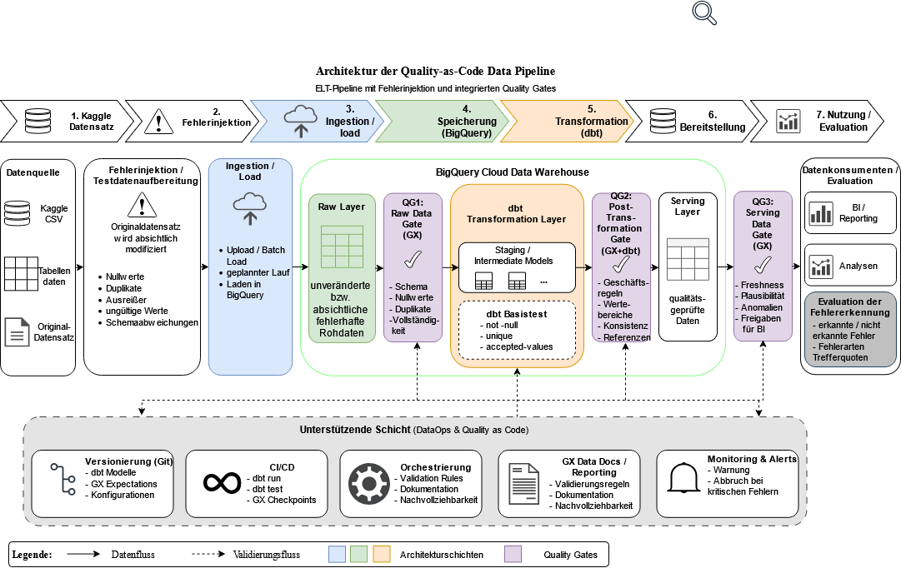

# Automated Data Quality Monitoring Framework (ELT)

## Overview

This repository contains the prototype and artifact developed as part of a Master's Thesis focusing on automated data quality monitoring in modern Data Engineering pipelines.

The artifact was developed following the **Design Science Research (DSR)** methodology and implements a **Quality-as-Code** approach for the automated detection, validation, monitoring, and reporting of data quality issues throughout an ELT pipeline.

The solution combines the following technologies:

* **Google BigQuery** as cloud-native data warehouse
* **dbt Core** for data transformation and technical integrity testing
* **Great Expectations (GX)** for automated data quality validation
* **Looker Studio** for monitoring and visualization
* **Python** for orchestration and execution of quality gates

---

## Research Context

This repository was developed as part of a Master's Thesis in Business Informatics.

### Research Objective

Design and evaluation of a DataOps-oriented framework for automated data quality monitoring using open-source technologies and cloud-native data platforms.

---

## Architecture



---

## Technology Stack

| Component          | Purpose                                 |
| ------------------ | --------------------------------------- |
| Google BigQuery    | Central Data Warehouse                  |
| dbt Core           | Data Transformation & Technical Testing |
| Great Expectations | Data Quality Validation                 |
| Looker Studio      | Monitoring & Reporting                  |
| Python             | Orchestration & Automation              |

---

## Quality Gate Architecture

The framework validates data quality at multiple stages of the pipeline using dedicated Quality Gates.

### QG1 – Raw Data Validation

Validation of incoming weather data before further processing.

Implemented as the first validation layer using Great Expectations.

Checks include:

* Mandatory field validation (`station_id`, `date`)
* Temperature range validation
* Consistency validation (`max_temp_c >= min_temp_c`)

---

### QG2 – Reference Data Validation

Validation of city and reference data used within the pipeline.

Implemented with Great Expectations.

Checks include:

* ISO country code validation
* Country code validation
* Pattern and format validation

---

### QG3 – Serving Layer Validation

Validation of transformed and prepared datasets before consumption.

Implemented with Great Expectations.

Checks include:

* Completeness checks
* Timeliness validation
* Value range validation
* Business rule validation

---

## dbt Technical Tests

In addition to the Quality Gates, dbt tests are executed on the transformed model.

Implemented tests include:

* `not_null`
* `unique`
* `accepted_values`

These tests provide an additional technical validation layer for structural data quality issues.

---

## Evaluation Scenarios

To evaluate the effectiveness of the framework, three different datasets are processed.

| Scenario    | Description                                                               |
| ----------- | ------------------------------------------------------------------------- |
| `clean`     | Dataset without injected quality issues                                   |
| `technical` | Dataset containing technical issues such as duplicates and missing values |
| `faulty`    | Dataset containing semantic and business-rule violations                  |

### Expected Behaviour

#### clean

* All Quality Gates pass successfully
* dbt tests pass successfully
* Dashboard shows no relevant quality issues

#### technical

* Technical issues are detected by dbt tests
* Structural quality problems become visible in monitoring

#### faulty

* Business-rule violations are detected by Great Expectations
* Data quality alerts are generated
* Dashboard visualizes reduced data quality scores

---

## Execution Guide

### 1. Execute dbt Transformation

```bash
dbt run --vars "{weather_table: daily_weather_clean}"
```

### 2. Execute dbt Tests

```bash
dbt test --vars "{weather_table: daily_weather_clean}"
```

### 3. Execute Great Expectations Quality Gates

```bash
python validate_qg1_raw.py clean
python validate_qg2_cities.py clean
python validate_qg3_serving.py clean
```

### 4. Load dbt Test Results

```bash
python load_dbt_results.py clean
```

---

## Monitoring & Reporting

All validation results are written to BigQuery and consolidated in the `dq_results` table.

The monitoring dashboard is implemented in Looker Studio and provides:

* Number of detected errors per scenario
* Failed checks per Quality Gate
* Validation results per scenario
* Distribution of checks across validation tools

---

## Repository Structure

```text
weather_pipeline/
├── models/
│   ├── schema.yml
│   └── stg_daily_weather.sql
├── dbt_project.yml

gx/
├── validate_qg1_raw.py
├── validate_qg2_cities.py
├── validate_qg3_serving.py
├── load_dbt_results.py

docs/
├── architecture.png

looker/
├── dashboard_exports
```

---

## Author

Master Thesis Project


